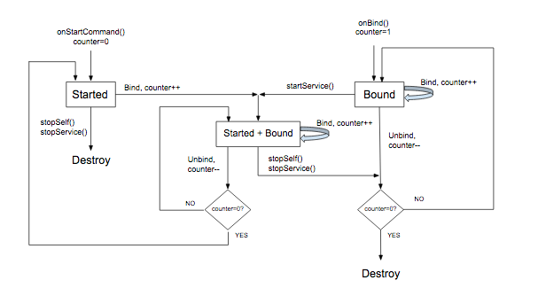

## 背景
最近我们Remote项目上线了一款语音书的功能，其实从技术上来说跟实现一个音乐app差不多；虽然我们之前的功能里面有本地音乐播放的功能，但之前的代码比较混乱，播放器与控制器之间耦合严重；根据Google官方的推荐的方式我准备使用MediaSession + ExoPlayer 的方式来实现我们语音书的功能。

## 什么是MediaSession
Media Session框架是google在android5之后引入的一个音乐播放框架，使用Client/Server架构；用来解决音乐控制界面和播放服务之间的通信问题，具体通信方式如下图所示：


## 如何使用
1.因为Android系统版本不断升级，所以Google也推出了Compat包来兼容高版本；所以我们需要在build.gradle 下添加Media依赖

```
implementation 'androidx.media:media:1.2.1'
```

2.创建媒体播放器服务
```
class MediaPlaybackService : MediaBrowserServiceCompat() {

	override fun onCreate() {  
	    super.onCreate()
		// Create a MediaSessionCompat  
		mediaSession = MediaSessionCompat(baseContext, 
		"MediaPlaybackService").apply {  
	    setSessionActivity(sessionActivityPendingIntent)  
	    isActive = true 
		}
		//设置sessionToken
		sessionToken = mediaSession.sessionToken
		
	}    

	//客户端调用content连接到服务器会回调次方法，我们可以通过是否返回BrowseRoot来告诉客户端
	//是否允许连接，连接成功之后框架会把客户端和服务绑定
	override fun onGetRoot(  
    clientPackageName: String,  //客户端的包名
    clientUid: Int,             //客户端进程的Uid
    rootHints: Bundle?          //请求携带的参数，可以为空
    ): BrowserRoot? {  
  
    return if (TextUtils.equals(clientPackageName, packageName)) {  
        Log.d(TAG, "connect Media service success")  
        BrowserRoot(MY_MEDIA_ROOT_ID, null)  
    } else {  
        null  
    }  

	override fun onLoadChildren(  
    parentId: String,  
    result: Result<MutableList<MediaItem>>  
	) {  
  
	}
}  
  
```


3.创建客户端浏览器
```
// Create MediaBrowserServiceCompat  
mediaBrowser = MediaBrowserCompat(  
    this,  
    ComponentName(this, MediaPlaybackService::class.java),  
    connectionCallbacks,  
    null // optional Bundle  
)
mediaBrowser.connect()//连接媒体播放服务器
```
 连接成功之后创建MediaController，然后将其保存到当前的Activity方便调用；有了MediaControl就可以对播放器发送各种控制指令了，然后服务端通过MediaSession.Callback 的回调就能收到相应的指令来告诉播放器干活
 ```
  val connectionCallbacks = object : MediaBrowserCompat.ConnectionCallback() {  
    override fun onConnected() {  
  
        // Get the token for the MediaSession  
        mediaBrowser.sessionToken.also { token ->  
  
            // Create a MediaControllerCompat  
            val mediaController = MediaControllerCompat(  
                this@VoiceBookActivity, // Context  
                token  
            )  
  
            // Save the controller  
            MediaControllerCompat.setMediaController(
            this@VoiceBookActivity, mediaController
            )  
        }  
  
        // Finish building the UI  
        buildTransportControls()  
    }  
  
    override fun onConnectionSuspended() {  
        // The Service has crashed. Disable transport controls until it 
        //automatically reconnects  
    }  
  
    override fun onConnectionFailed() {  
        // The Service has refused our connection  
    }  
}
```
 
监听播放状态，显示UI 
```
fun buildTransportControls() {  
    MediaControllerCompat.getMediaController(this@VoiceBookActivity)?.apply { 
	    //如果后台服务处于播放状态，初始化控制器 
        if (metadata != null && playbackState.isPrepared) {  
            showBottomBar(metadata.description)  
            notifyPlayState()  
            binding.ivBottomPlay.setImageResource(  
                if (playbackState.isPlaying)
                R.drawable.music_bottom_bar_pause
                  else  
                R.drawable.music_bottom_bar_play  
            )  
        } else {  
            transportControls.setRepeatMode(PlaybackStateCompat.REPEAT_MODE_ALL)  
        }  
        
        // Register a Callback to stay in sync  
        registerCallback(controllerCallback)  
    }  
}

val controllerCallback = object : MediaControllerCompat.Callback() {  
  
  //播放数据变化
    override fun onMetadataChanged(metadata: MediaMetadataCompat?) {  
        Log.d(TAG, "onMetadataChanged :${metadata?.id}")  
        metadata?.description?.let {  
            showBottomBar(it)  
        }  
    }  
	//播发状态变化
    override fun onPlaybackStateChanged(state: PlaybackStateCompat?) {  
        Log.d(TAG, "onPlaybackStateChanged :${state?.isPlaying} ")  
        notifyPlayState()  
        binding.ivBottomPlay.setImageResource(  
            if (state?.isPlaying == true) 
            R.drawable.music_bottom_bar_pause
             else  
            R.drawable.music_bottom_bar_play  
        )  
    }  
}
```

## ExoPlayer
[ExoPlayer](http://google.github.io/ExoPlayer/) 是一个不在 Android 框架内的开放源代码项目，它与 Android SDK 分开提供。ExoPlayer 的标准音频和视频组件基于 Android 的 MediaCodec API 构建，我们Framework提供的MediaPlayer虽然也能播放m3u8的文件，但不支持列表播放、模式切换、倍速切换等；关键是跟Media Session也做了兼容使用起来非常方便

添加依赖
```
implementation "com.google.android.exoplayer:exoplayer-core:$exoplayer_version"  
implementation "com.google.android.exoplayer:exoplayer-ui:$exoplayer_version"  
implementation "com.google.android.exoplayer:extension-mediasession:$exoplayer_version"  
implementation "com.google.android.exoplayer:exoplayer-hls:$exoplayer_version"
```

初始化播放器
```
private val uAmpAudioAttributes = AudioAttributes.Builder()  
    .setContentType(C.CONTENT_TYPE_MUSIC)  
    .setUsage(C.USAGE_MEDIA)  
    .build()
//为了给用户一个良好的收听体验，需要处理以以下几项事项
private val exoPlayer: ExoPlayer by lazy {  
    ExoPlayer.Builder(baseContext).build().apply { 
	    //处理音频焦点 
        setAudioAttributes(uAmpAudioAttributes, true)  
        //处理Noisy，比如媒体通道从耳机切换到扬声器的时候要暂定播放
        setHandleAudioBecomingNoisy(true) 
        //WifiLock & WakeLock 通常情况下在锁屏30分钟后，系统出于省电考虑可能会断开Wi-Fi
        //网络和关闭CPU，需要在播放的过程中保持唤醒
        setWakeMode(C.WAKE_MODE_NETWORK)  
        addListener(playerListener)  
    }  
}
```

设置与media session的通信 & 通知处理
```
override fun onCreate() {  
    super.onCreate() {
	    ·······
	    //借助PlayerNotificationManager管理通知，Exoplayer给我封装好了MediaStyle
	    //的通知，并处理了媒体会话
		notificationManager = NotificationManager(  
		    this,  
		    mediaSession.sessionToken,  
		    PlayerNotificationListener()  
		)
		notificationManager.showNotificationForPlayer(exoPlayer)

		// ExoPlayer will manage the MediaSession for us.  
		mediaSessionConnector = MediaSessionConnector(mediaSession)  
		//初始化媒体数据，我们语音书里面只要处理列表初始化就能满足需求了
		mediaSessionConnector.setPlaybackPreparer(PlaybackPreparer())  
		//控制导航器，客户端的MediaControl发送的：上一曲、下一曲、等操作会回调到这个
		mediaSessionConnector.setQueueNavigator(QueueNavigator(mediaSession)) 
		//也可以设置一些自定义的操作，比如我们语音书里面调整玩具的敏感度 
		mediaSessionConnector.setCustomActionProviders(
				SpeedCustomActionProvider()
		)
		//把播放器设置到Session连接器，这个里面封装了播放器的回调事件通过Callback回调给
		//了客户端,这里不做过多描述，可以自行查看源码 
		mediaSessionConnector.setPlayer(exoPlayer)
    }
	//添加通知的显示与取消
	inner class PlayerNotificationListener : 
								PlayerNotificationManager.NotificationListener {
	
	    override fun onNotificationPosted(  
	        notificationId: Int,  
	        notification: Notification,  
	        ongoing: Boolean  
	    ) {  
		    //开始播放的时候，应该开启服务，因为客户的连接到服务器的时候只绑定了服务，
		    //避免客户端断开连接的时候服务销毁
	        if (ongoing && !isForegroundService) {  
	            ContextCompat.startForegroundService(  
	                applicationContext,  
	                Intent(
	                applicationContext, 
	                this@MediaPlaybackService.javaClass)  
	            )  
  
	            startForeground(notificationId, notification)  
	            isForegroundService = true  
	        }    
        }  
     
		//通知取消的时候停止服务
	    override fun onNotificationCancelled(
							    notificationId: Int,
							     dismissedByUser: Boolean
		) {  
	        stopForeground(true)  
	        isForegroundService = false  
	        stopSelf()  
	    }  

		override fun onPlayWhenReadyChanged(
			playWhenReady: Boolean, reason: Int) {  
		    if (!playWhenReady) {  
				//当播放暂定的时候，应改把服务致于后台，避免通知不能取消
	            stopForeground(false)  
		        isForegroundService = false  
		    }   
	    }  
	} 
}
```
播放列表初始化处理
```
	inner class PlaybackPreparer : MediaSessionConnector.PlaybackPreparer {  
	    
  
	    override fun getSupportedPrepareActions(): Long =  
	        PlaybackStateCompat.ACTION_PREPARE_FROM_MEDIA_ID or  
                PlaybackStateCompat.ACTION_PLAY_FROM_MEDIA_ID  
  

  
	    @Suppress("UNCHECKED_CAST")  
	    override fun onPrepareFromMediaId(  
	        mediaId: String,  
	        playWhenReady: Boolean,  
	        extras: Bundle?  
	    ) {  
        extras?.let { bundle ->  
            val audioBookList =
            bundle.getSerializable(AUDIO_BOOK_LIST) as List<AudioBookList>  
            val playList = audioBookList.map {  
                MediaMetadataCompat.Builder().from(it).build()  
            }  
            val itemToPlay = playList.find {  
                it.id == mediaId  
            }  
            preparePlaylist(playList, itemToPlay, playWhenReady)  
        }  
  
    }  
	//初始化播放列表
	private fun preparePlaylist(  
	    metadataList: List<MediaMetadataCompat>,  
	    itemToPlay: MediaMetadataCompat?,  
	    playWhenReady: Boolean  
	) {  
	    val initialWindowIndex = metadataList.indexOf(itemToPlay)  
	    currentPlaylistItems = metadataList  
	    exoPlayer.playWhenReady = playWhenReady  
	    exoPlayer.stop()  
	    exoPlayer.setMediaItems(
		    metadataList.map { it.toMediaItem() }, 
		    initialWindowIndex,
		    0
	   )  
	    exoPlayer.prepare()  
	}
```

导航控制器
```
inner class QueueNavigator(  
    mediaSession: MediaSessionCompat  
) : TimelineQueueNavigator(mediaSession) {  

	//当前媒体播放信息
    override fun getMediaDescription(
		    player: Player, windowIndex: Int
	    ): MediaDescriptionCompat {  
        if (windowIndex < currentPlaylistItems.size) {  
            return currentPlaylistItems[windowIndex].description  
        }  
  
        return MediaDescriptionCompat.Builder().build()  
    }  
	
    override fun onSkipToNext(player: Player) {  
        player.seekToNextMediaItem()  
    }  
	//理论上来说这个操作我们不用处理，但测试小姐姐说我这个地方有bug；有时候能切换到上一曲，有
	//有时候就会从0开始播放，我试着解释：“这是因为播放器的onSkipToNext做了一些处理，如果播放
	//的开始时间小于3秒才会切到上一曲，否则就seek到0 开始播放”。我不听我不听反正你这个问题要
	//解决
    override fun onSkipToPrevious(player: Player) {  
        player.seekToPreviousMediaItem()  
    }  
  
}
```

媒体服务生命周期
`MediaBrowserService` 的生命周期由以下几个因素决定：服务的创建方式、绑定到服务的客户端数量，以及服务从媒体会话回调收到的调用。总结：

-   在以下两种情况下会创建该服务：为了响应媒体按钮而启动该服务时，或者当 Activity 绑定到该服务时（通过其 `MediaBrowser` 连接后）。
-   媒体会话 `onPlay()` 回调应包含调用 `startService()` 的代码。这样可以确保服务在与之绑定的所有界面 `MediaBrowser` Activity 都解除绑定后，仍能启动并继续运行。
-   `onStop()` 回调应调用 `stopSelf()`。如果服务已启动，则会停止服务。此外，如果没有 Activity 绑定到服务，服务会被销毁。否则，服务将保持绑定状态，直到其所有 Activity 解除绑定。（如果在销毁服务之前收到后续的 `startService()` 调用，则会取消待处理的停止操作。）

以下流程图演示了如何管理服务的生命周期。可变的计数器跟踪绑定的客户端数量：


## 参考

* [Android 媒体应用架构指南](https://developer.android.com/guide/topics/media-apps/audio-app/building-an-audio-app?hl=zh-cn)
* [UAMP](https://github.com/android/uamp)
* [ExoPlayer](https://exoplayer.dev/hello-world.html)
